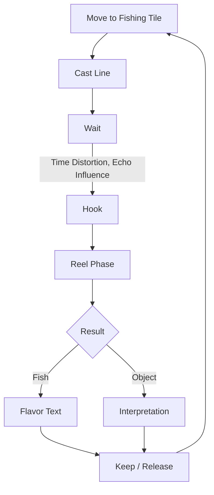
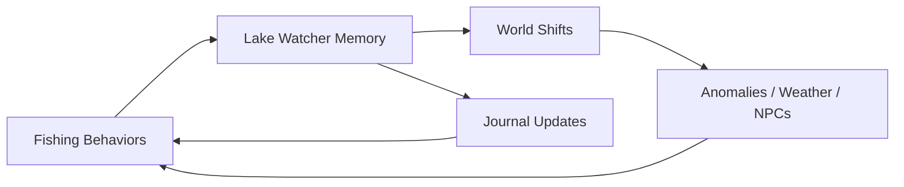
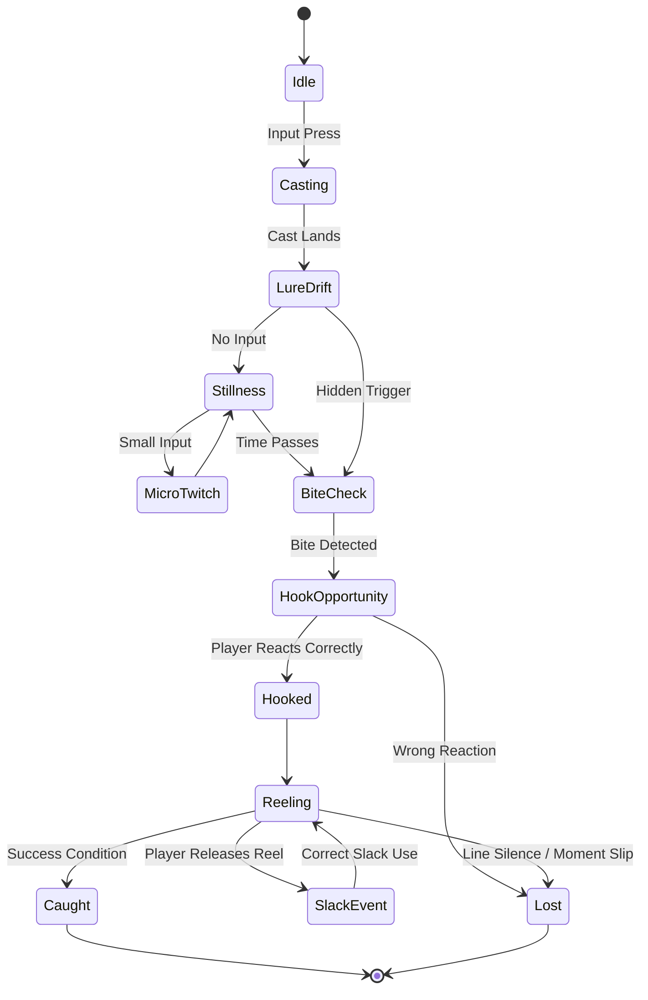
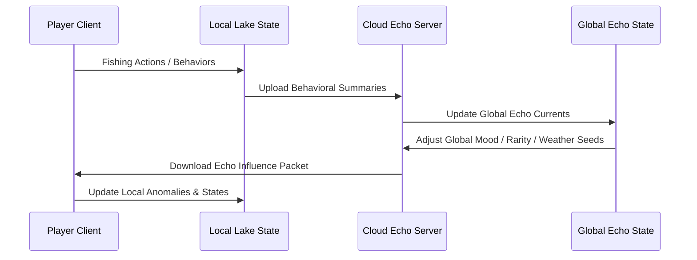
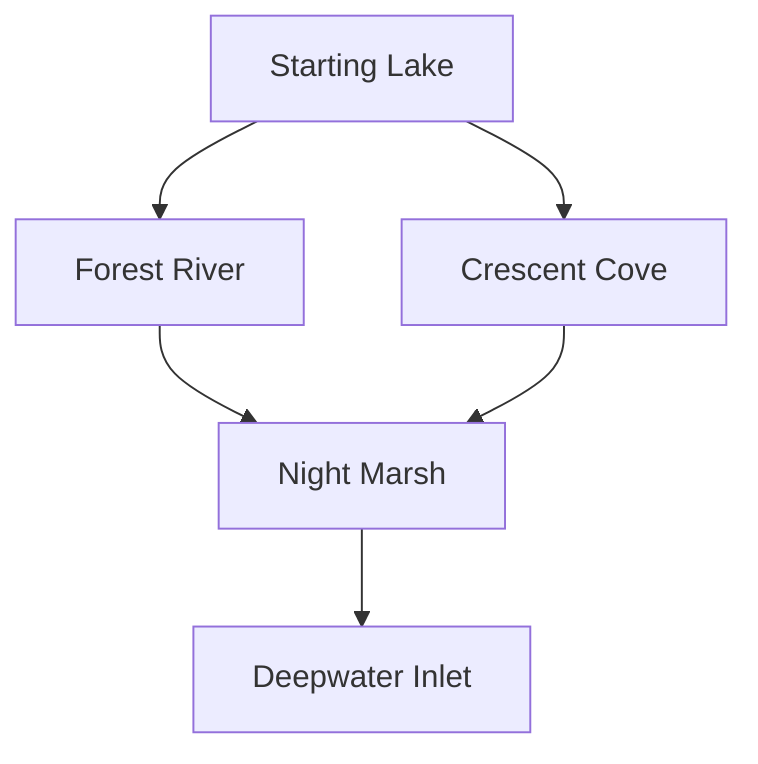
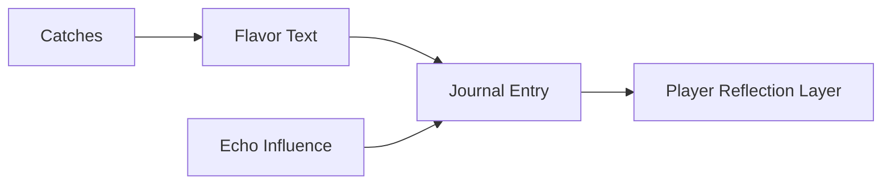
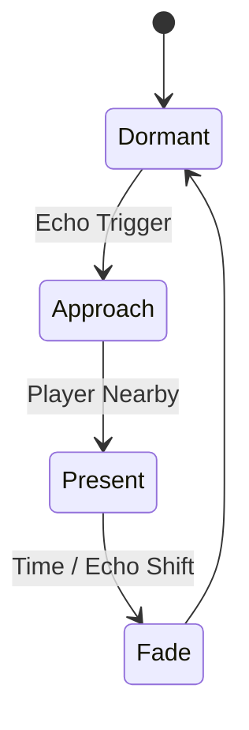
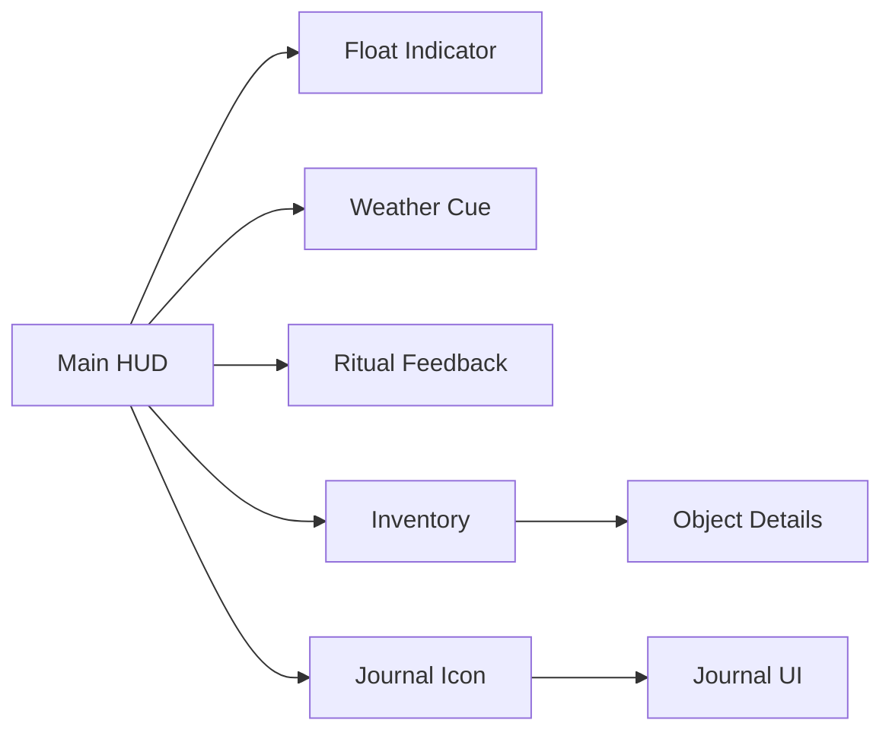

# Stillwater — Game Design Document (Pre‑Production Draft 1.0)
*A contemplative isometric fishing game about loneliness, connection, and quiet surrealism.*  
*(Includes diagrams and pre-production structure)*

---

# 0. Document Information
**Project:** Stillwater  
**Draft:** Pre‑Production GDD v1.0  
**Engine:** Unity (2022+ LTS, 2D Isometric)  
**Multiplayer:** Asynchronous Strand System  
**Primary Sources:** Vision Document, GDD Draft 0.2 & 0.3

---

# 1. High‑Level Overview

## 1.1 Core Concept
Stillwater is a meditative, narrative-light fishing game built around an esoteric, symbolic fishing system and atmospheric exploration. Players inhabit parallel worlds that softly influence one another through asynchronous data exchange.

## 1.2 Tone & Themes
Calm, melancholic, dreamlike, subtly surreal.  
Primary themes include existential loneliness, connection, stillness, and the unknowable.

## 1.3 Engine & Rendering
- Unity 2D URP  
- Pixel-perfect camera  
- True isometric tilemaps  
- Dynamic lighting & shader-based water  
- Custom depth sorting and grid layers  

---

# 2. Core Pillars

### 2.1 Mechanical Storytelling
The fishing system is the narrative. Ritual patterns, waiting, stillness, and subtle decision-making create meaning.

### 2.2 Esoteric but Optional Complexity
Deep and strange mechanics enrich the system—never mandatory for progression.

### 2.3 Asynchronous Connection
Players influence each other indirectly via “Echo Currents,” residues, rarity shifts, and journal fragments.

### 2.4 Subtle Surrealism
Escalating anomalies triggered by both personal and global emotional patterns.

---

# 3. Gameplay Structure

## 3.1 Moment-to-Moment Loop

## 3.2 Meta Loop

---

# 4. Fishing System (Esoteric Core)

## 4.1 System Overview
Fishing is composed of five expressive layers:
1. **Casting (Ritual)**
2. **Lure Behavior (Expression)**
3. **Waiting (Temporal)**
4. **Hooking (Intuition)**
5. **Reeling (Confrontation)**

## 4.2 State Machine

## 4.3 Hidden Logic Layers
- **Echo Mood Conditions** (Stillness, Loss, Curiosity, Disruption)  
- **Fish Route Tables** — invisible paths influenced by global and personal state  
- **Temporal Windows** — some bites occur during liminal temporal frames  
- **Anomaly Hooks** — rare surreal events tied to ritualistic behavior  

---

# 5. Asynchronous Multiplayer (“Strand System”)

## 5.1 Data Flow Diagram

## 5.2 Types of Shared Influence
- **Echo Currents:** Aggregated global behaviors alter anomaly rates, fish migrations.
- **Residue Markers:** Environmental traces left by other players.
- **Shared Journals:** Occasionally receive a variant page shaped by another player.
- **Rarity Drift:** Player choices affect spawning probabilities globally.

---

# 6. World & Environment

## 6.1 Zone Layout

## 6.2 Zone Characteristics
- **Starting Lake:** Calm, safe, minimal surrealism  
- **Forest River:** Narrow, flow-based fish, unusual sound cues  
- **Crescent Cove:** Tides, reflection anomalies  
- **Night Marsh:** Fog, drifting lights, temporal distortions  
- **Deepwater Inlet:** Rare encounters, escalating surrealism  

---

# 7. Narrative & Journal Systems

## 7.1 Narrative Delivery
No explicit plot. Story emerges through:
- Fishing behaviors  
- Environmental shifts  
- Journal fragments  
- Strange objects  

## 7.2 Journal Diagram

Journal pages combine:
- Player behaviors  
- Echo contributions  
- Procedurally varied emotional framing  

---

# 8. NPC System

### Sparse, enigmatic, symbolic characters that:
- Appear based on Echo states  
- Offer flavor instead of exposition  
- Act as environmental punctuation  

NPCs follow a simple state machine:

---

# 9. UI & UX

## 9.1 Principles
Minimal, diegetic, warm, slow-paced.  
Visual noise is avoided.

## 9.2 UI Map

---

# 10. Technical Design Notes (Unity)

## 10.1 Systems Overview
- **Isometric Tilemap Grid** — layered rule tiles, smart painting  
- **Pixel Camera** — orthographic, pixel snapping  
- **Fishing FSM** — ScriptableObject-driven  
- **Lake Watcher** — central mood manager  
- **Echo Sync** — periodic async fetch & upload  
- **World Seeds** — control anomalies, weather, rarity  
- **Anomaly Manager** — triggers surreal events  

## 10.2 Data Structures
- `FishDefinition`  
- `EchoPacket` (local → cloud)  
- `EchoCurrent` (cloud → clients)  
- `JournalEntry`  
- `TileResidueMarker`  

## 10.3 Performance Goals
- Low GPU load  
- Tilemap-friendly physics  
- Lightweight networking (<1KB packets)  

---

# 11. Open Design Questions

- How strong should anomaly escalation be?  
- What is the long-term rhythm of global Echo Currents?  
- Should players influence zone unlock order?  
- Should the journal ever hint at a shared emotional arc?  

---

# 12. Appendix

## 12.1 Art Direction Notes
- Muted earth tones  
- 1:1 pixel density  
- Soft dithering and brush texture overlays  
- Limited animation frames for serenity  

## 12.2 Audio Direction Notes
- Lo-fi field recordings  
- Gentle wind, reeds, water  
- Subtle tonal cues tied to Echo states  

---

# END OF DOCUMENT
